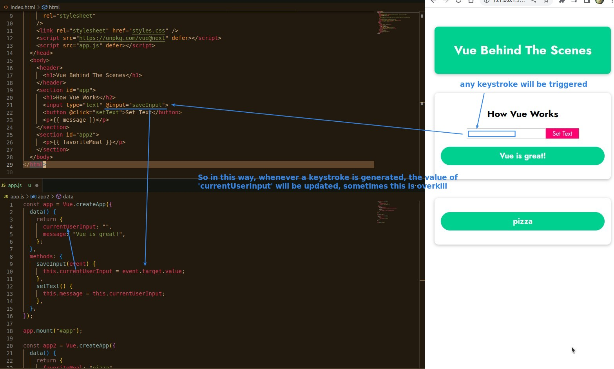
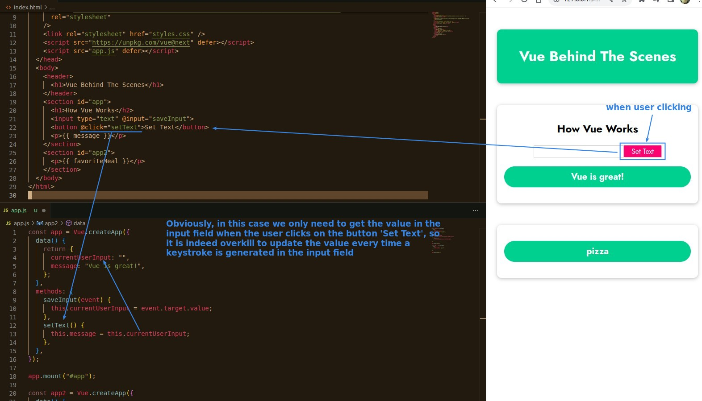
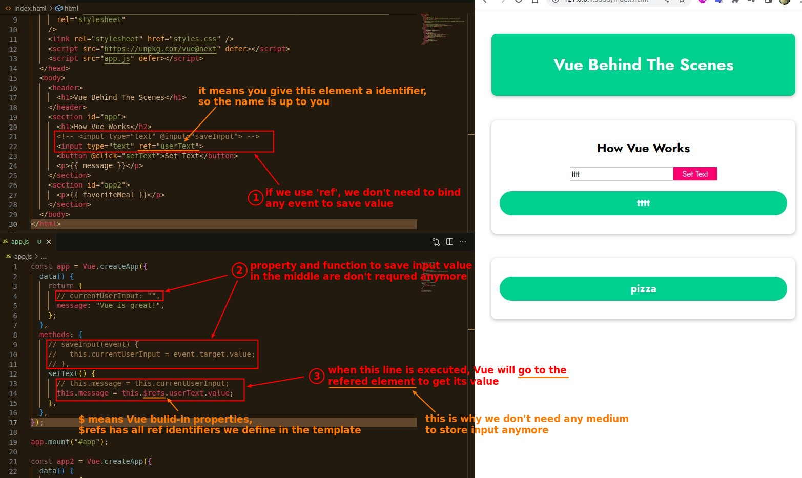
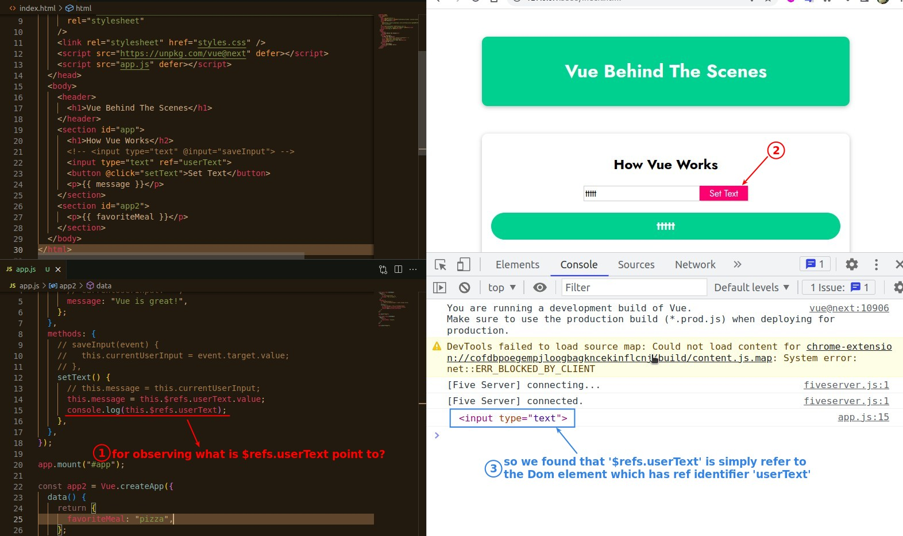

## **Analyze original way to save input**

## **Switch to Refs way**

## **What is $refs pointing to?**

- $refs refers to the DOM element in native JS, so as long as this DOM element has properties, you can access them all.
