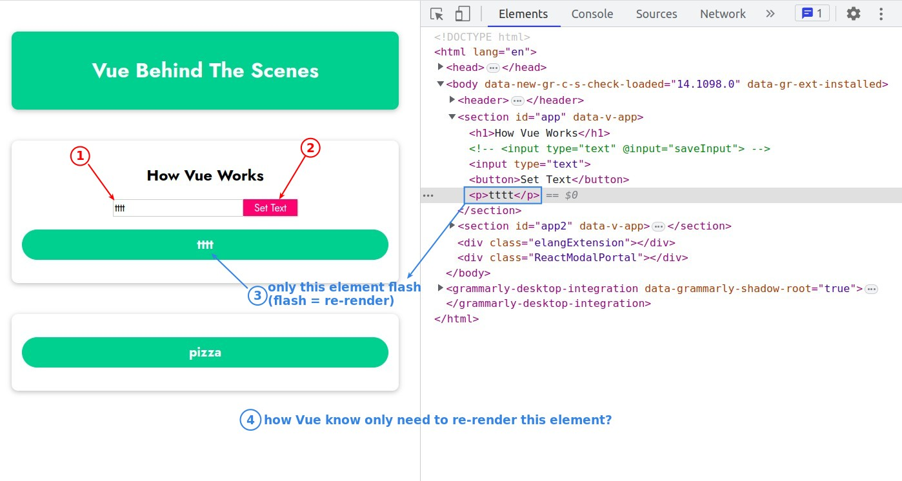
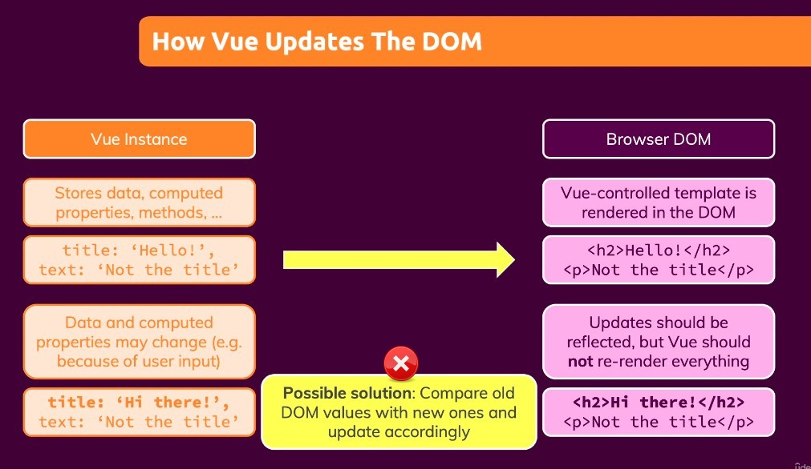
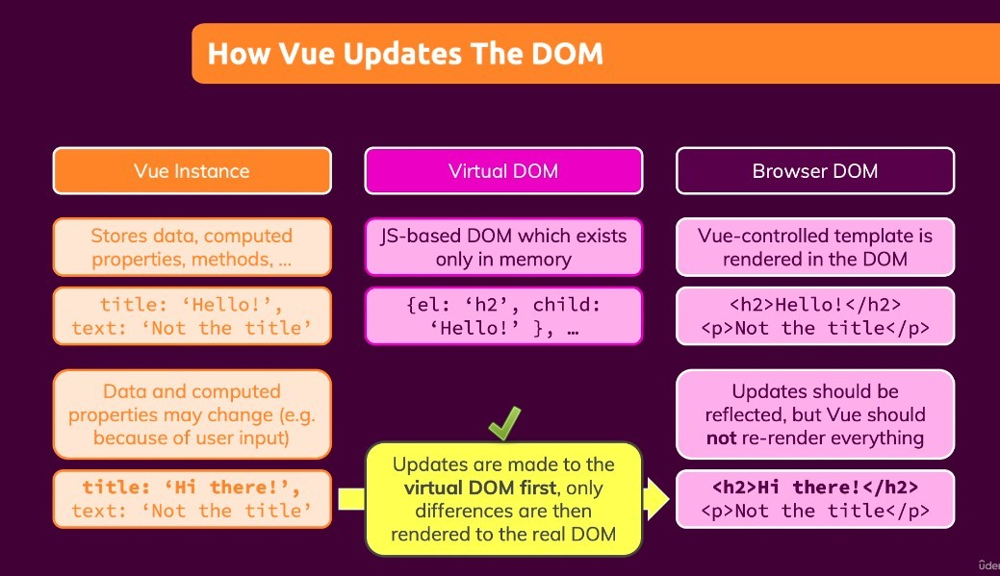

## **How does Vue only re-render right codes of HTML?**

> We've previously discussed data reactivity, but how to efficiently render to the browser is a completely different topic.

## **Compare between Virtual DOM**

> Vue actually generates something called the Virtual DOM to compare the differences and determine which parts of the browser should be re-rendered.

- Every time the value of a Vue app property changes, a virtual DOM is generated based on current DOM contents.
  - The content of the virtual DOM is much cleaner than the real DOM, because the only purpose is to identify the difference between the previous and subsequent virtual DOMs.
  - The virtual DOM is placed in memory, so the comparison between them is very fast.
  - In fact, not all DOM content is written into the virtual DOM, there are many optimization processes, but we don't need to understand them.
