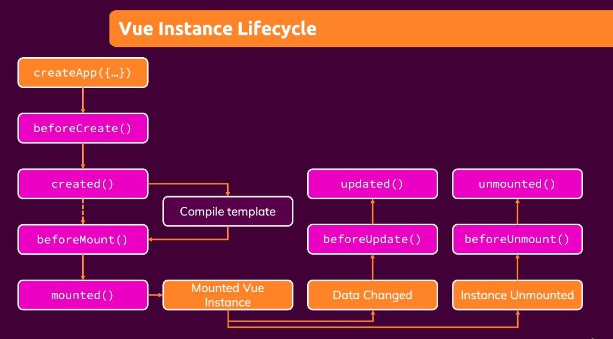

- Yellow block indicates the event occurred.
- beforeCreate()
  - before the app is fully initiallized.
- create()
  - after the app is full initialized.
- compile template
  - replace HTML interpolation, various directive, special attributes... to concrete value of HTML codes.
- beforeMount()
  - right before Vue bring something to screen.
- mount()
  - Vue just bring all the things to the screen.
- beforeUpdate, update()
  - similar to beforeCreate() and create(), but in hook update(), screen already has updated data becasue Vue never unmount at this moment.
- Instance Unmounted
  - when Vue unmounted, all data loss and Vue app dead.
- beforeUnmount(), afterUnmount()
  - As it is clear.
