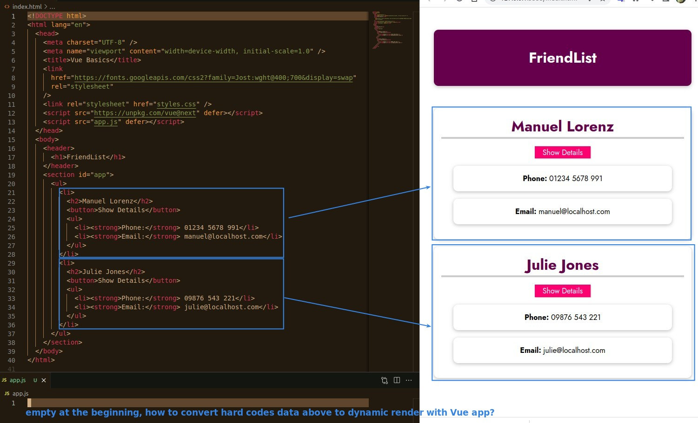
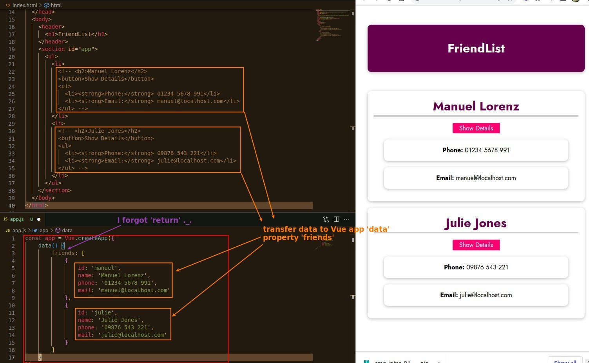
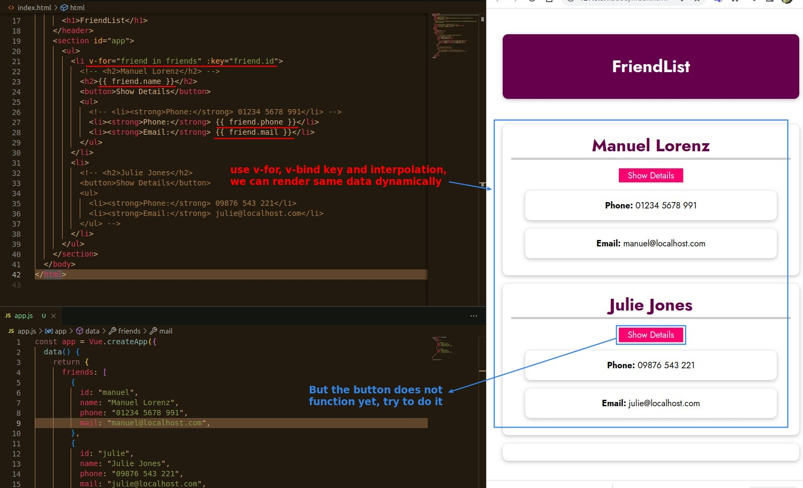
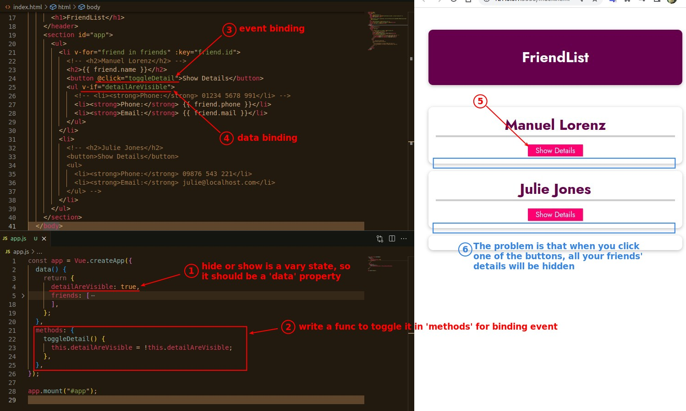
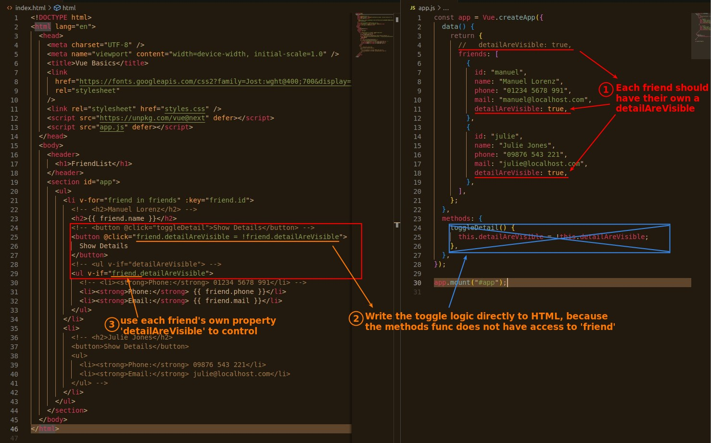
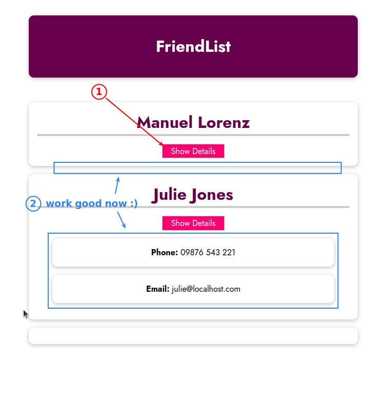

## **First Question: Convert HTML hardcore to Vue app**

## **Try to Implement functionality of buttons**

## **Fix the problem**

- But in this case, every time we add a friend's data, we have to add the detailAreAvailable property for them, is there a better way to do it?
