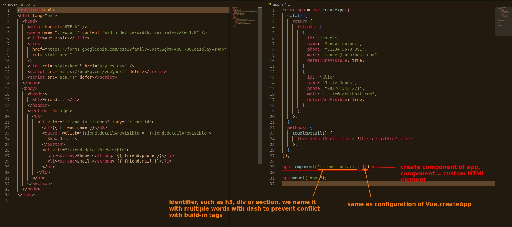
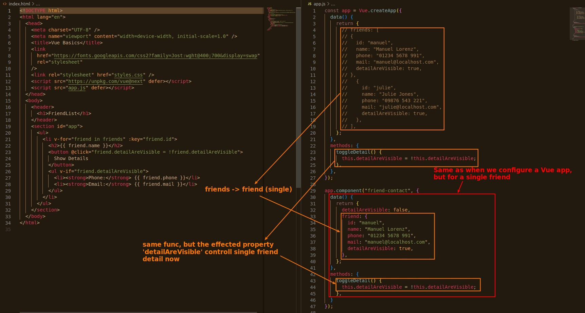
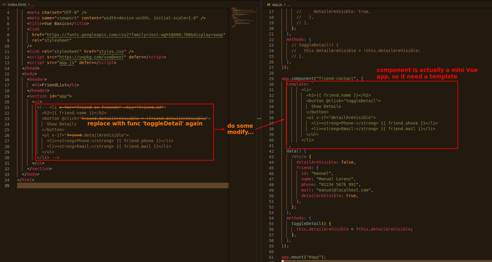
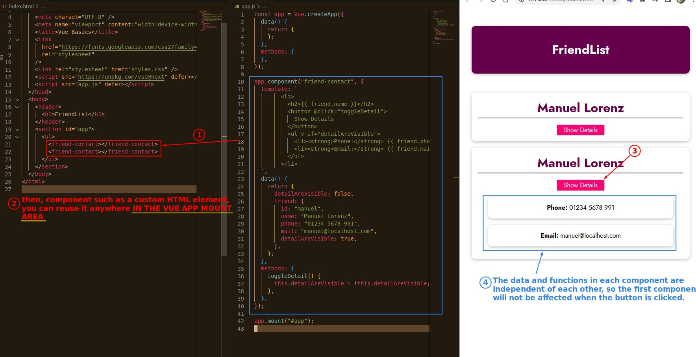

## **Create a component: first step**

- Because the tags of HTML build-in elements are all single words, we use multiple words as the identifier of the component.

## **Transfer data/functions from main Vue app to the component**

- component only stores the data of a single friend, so we add the 'data' property 'detailAreAvailable' back to the component won't have the previous problem.

## **Build template of component**

## **Use component in HTML as element**

- The next course will teach how to use the same component but bring in different data.

- And later we will teach how to define template in a better way instead of string template.
