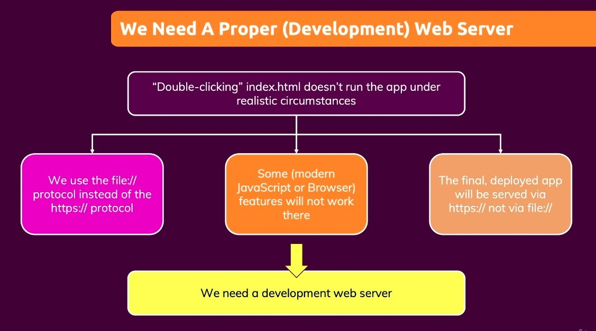

- So far we have been using file protocol to test our app, that has some problems...
  - Some JavaScript features don't work on file protocol.
  - User visit you app through HTTPs protocol.
- We can build a development web server in our local machine.
  - Although in local machine, but using HTTP protocol to server our HTML.
