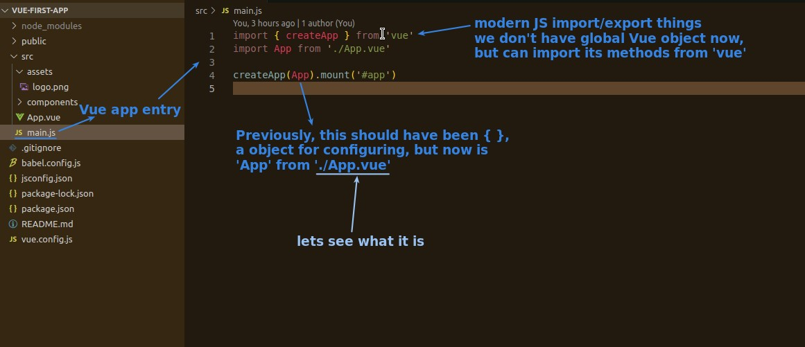
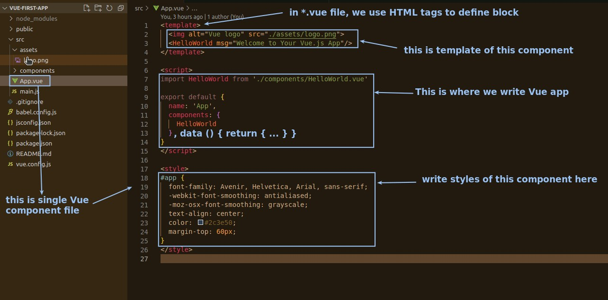
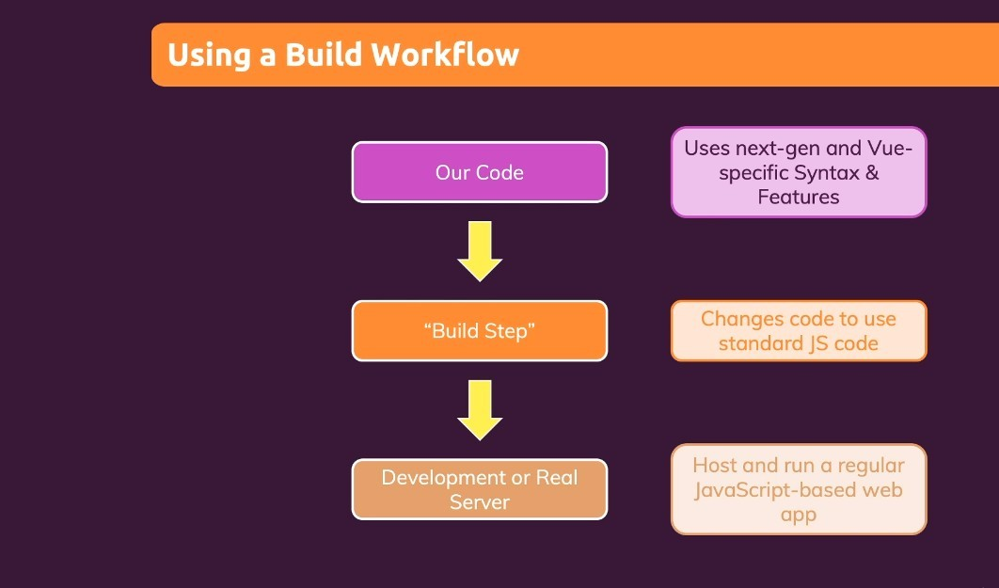

## **Entry of Vue app**

- Our Vue app defaults to running the main.js file first.

## **\*.vue**

- Usually a vue file is a component.
- browser can't understand this file.

## **Build Step**

- The above image shows that our codes in \*.vue cannot be understood by the browser, and must be converted to regualr JavaScrip by the build step in order to be rendered in the browser.
