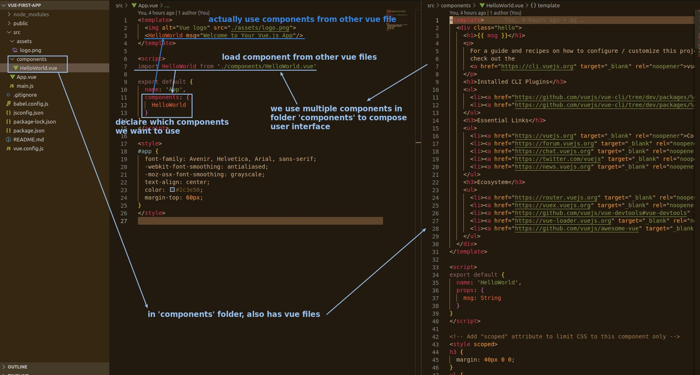

- So the vue file can be written as a Vue app or Vue component.
  - The vue file under the src root directory is where the Vue app is written.
  - The vue file under the component directory is where the Vue component is written.
