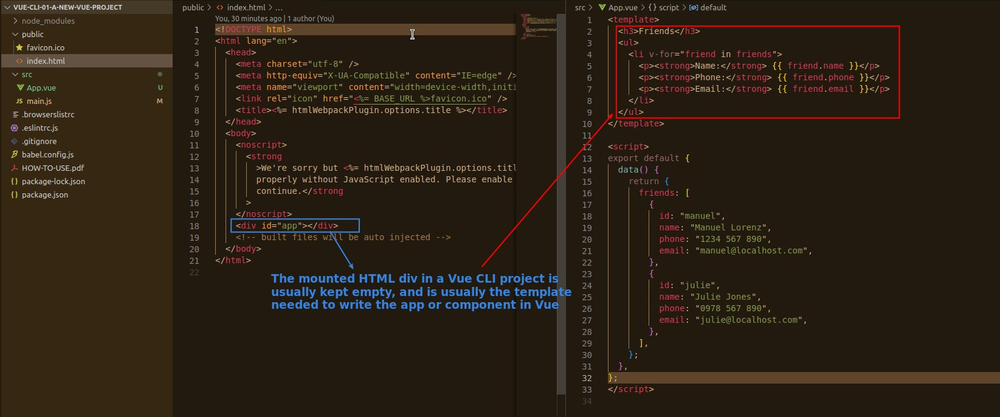
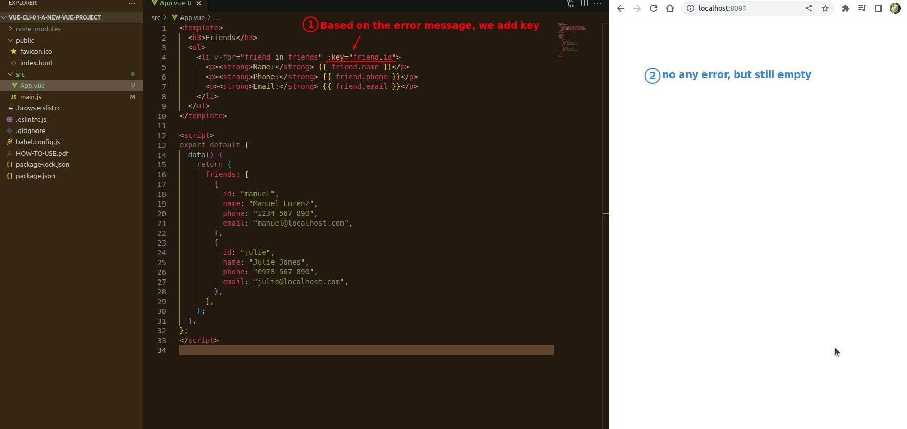

## **App.vue & script export/import**

### _ES6 JavaScript import/export concept_

- The first import is loaded from the package so just specify the package name, and it's not default so there will be curly brackets.
- The second import is loaded from our own file App.vue, so we have to specify the path of the file, and it's default, so we can name what we want to load without curly brackets.

## **template**

## **page and error**

- When we don't use Vue CLI, there is no problem when using v-for iterate HTML element without 'key', but Vue CLI will generate an error, which shows that Vue CLI is more stringent.

