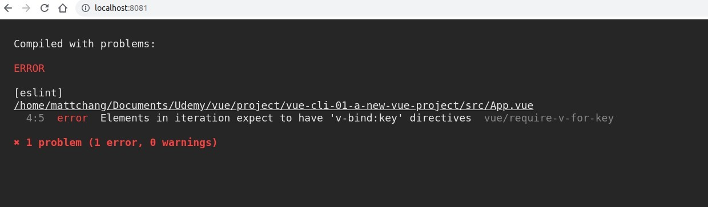

## **App.vue & script export/import**

## **template**

## **page and error**

- When we don't use Vue CLI, there is no problem when using v-for iterate HTML element without 'key', but Vue CLI will generate an error, which shows that Vue CLI is more stringent.

- After adding the 'key', the page did not show what I expected, I will fix this problem later in the course.
