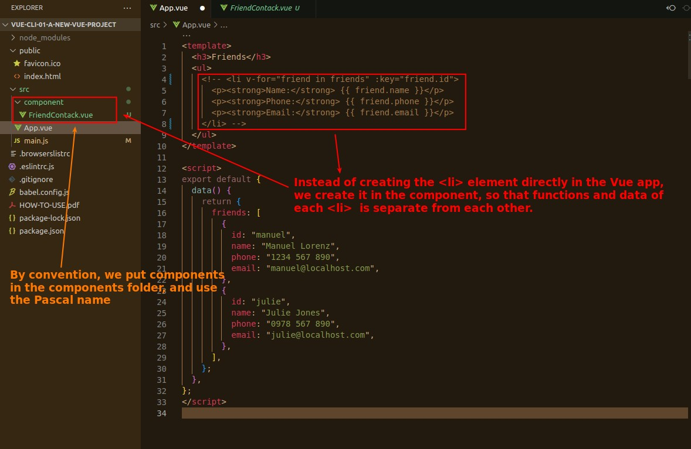
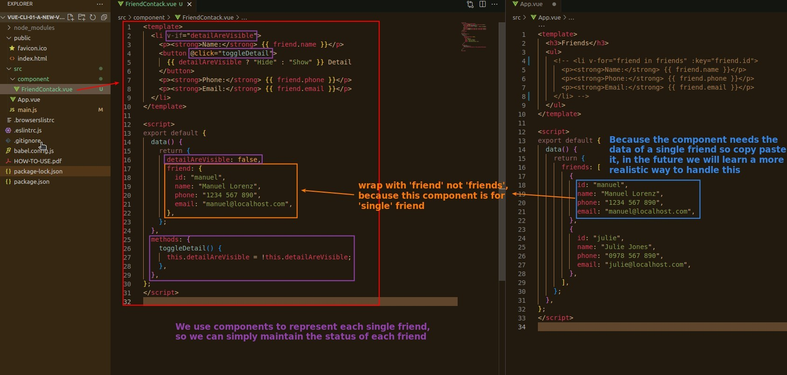
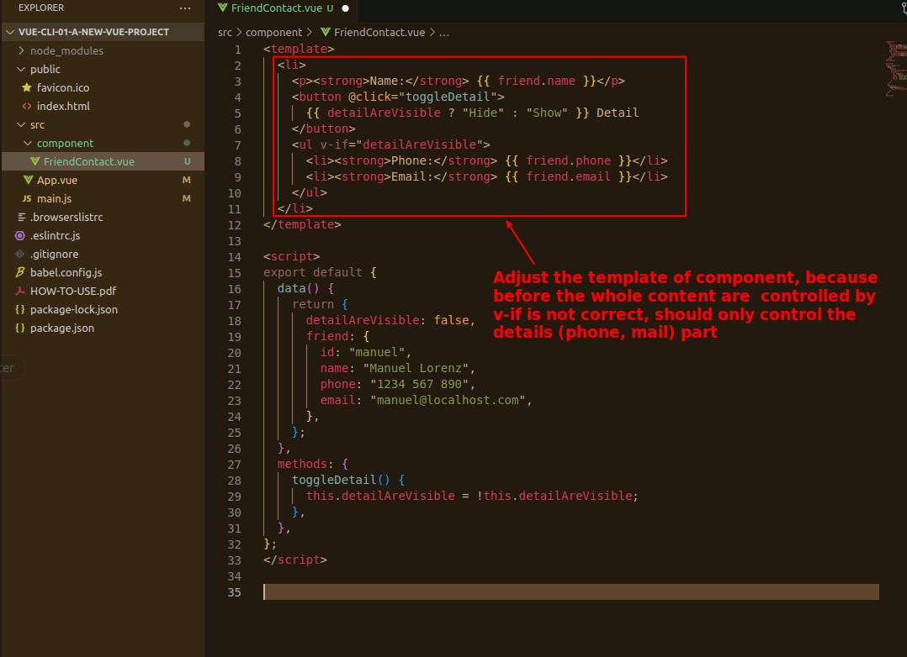
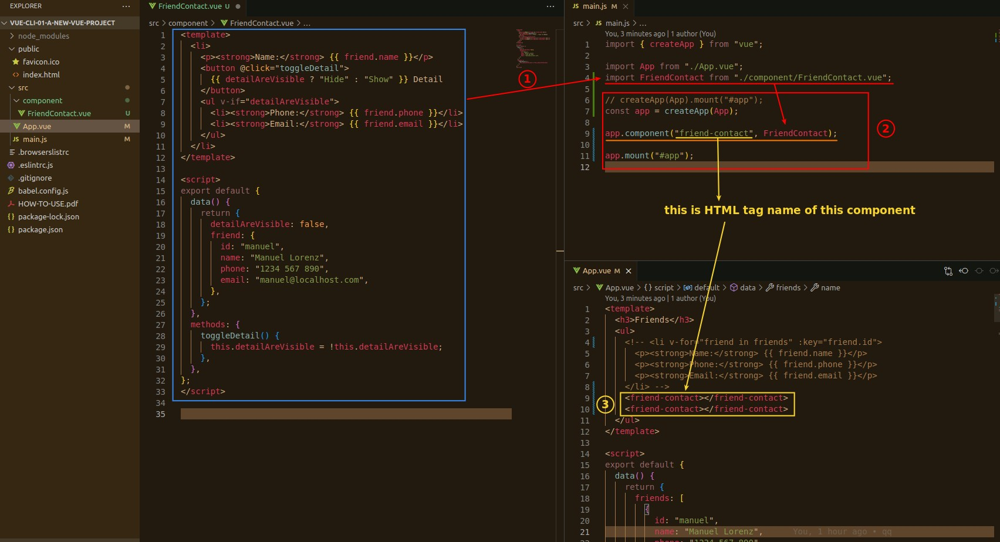
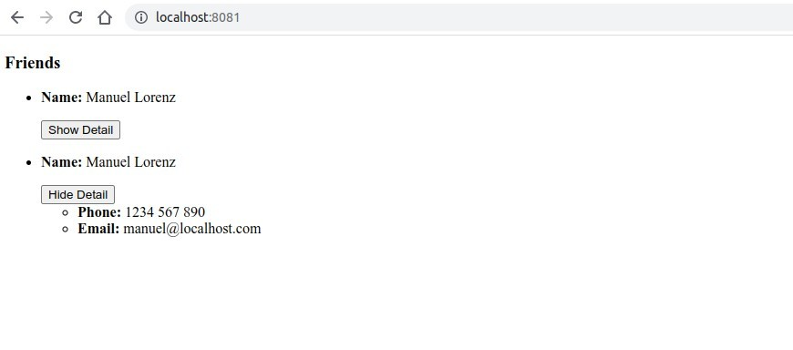

## **Create and Build Component**

### _file of component_

j

### _content of component_

## **Import to main.js and use in template of App.vue**

### _how to import/use it_

### _page checking_

