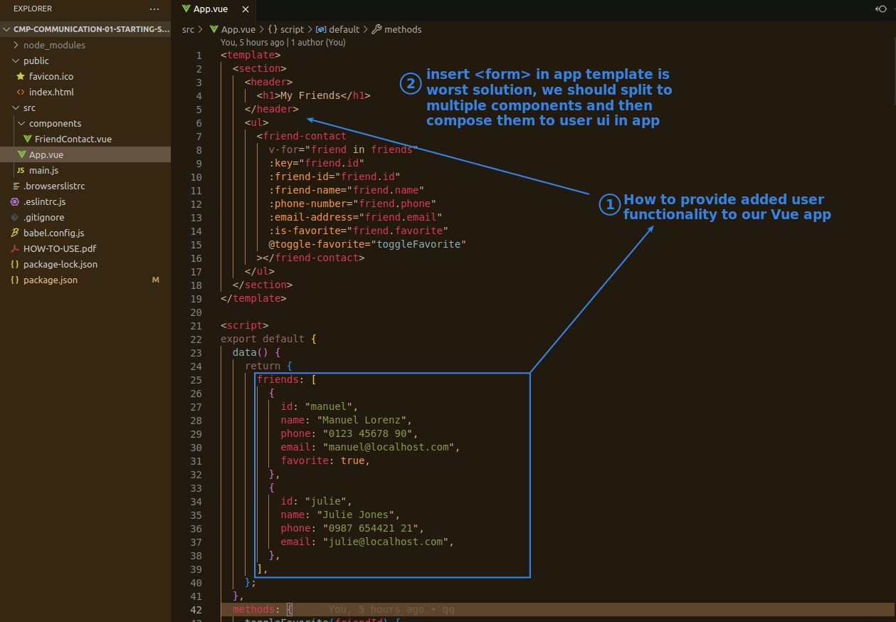
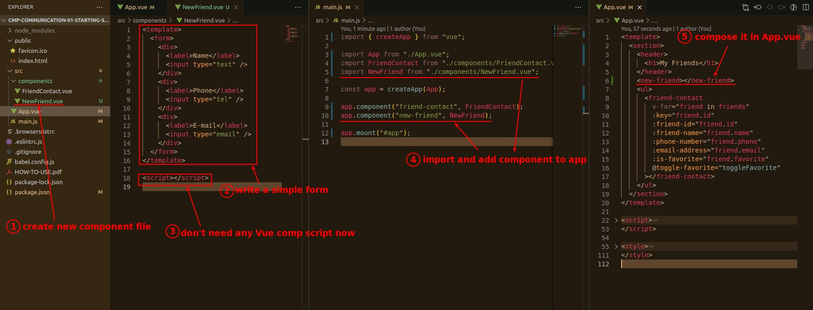
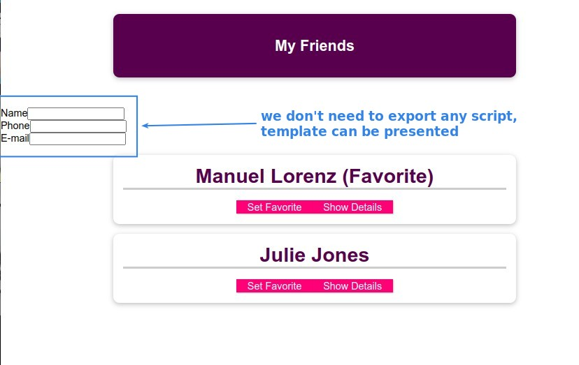
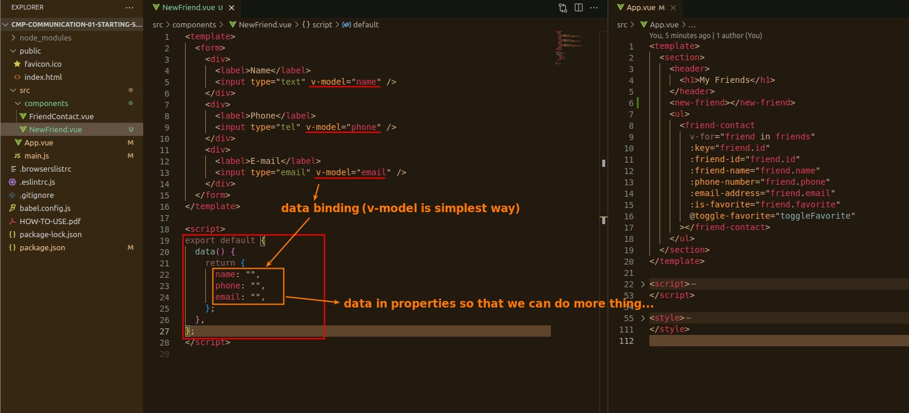
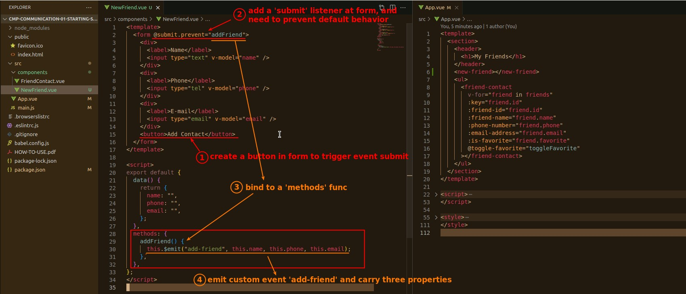
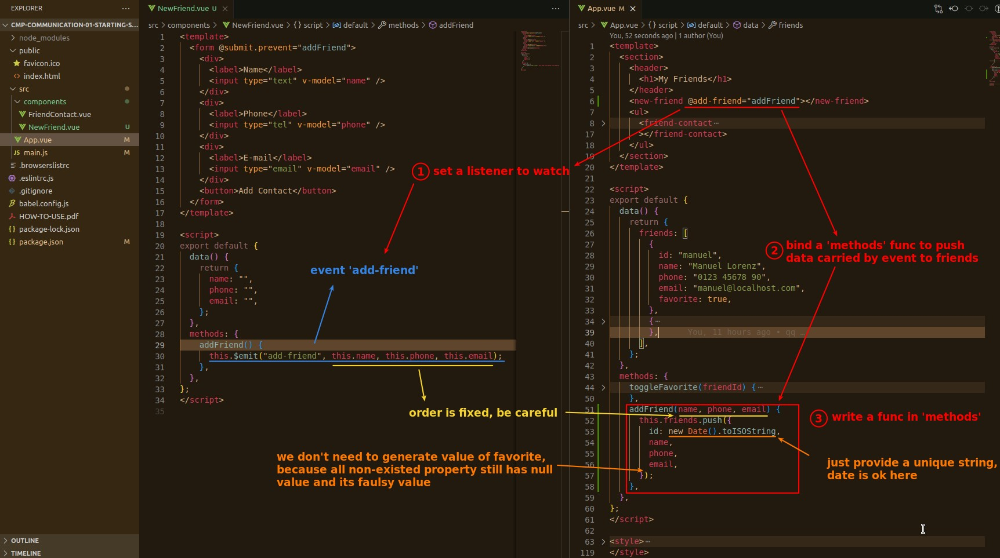
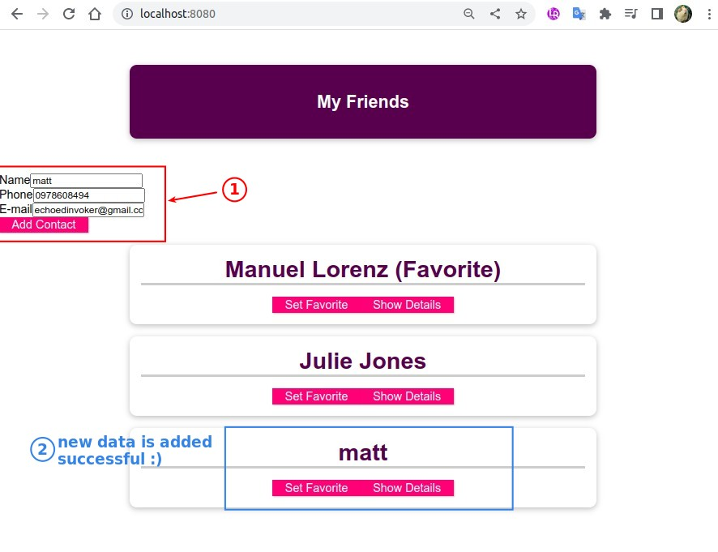

## **Can We Just Add a Form to Insert New Data?**

## **New component & template first**

## **Child: collect inputs to data and emit custom event**

## **Parent: set listener and bind a method to push new data**

