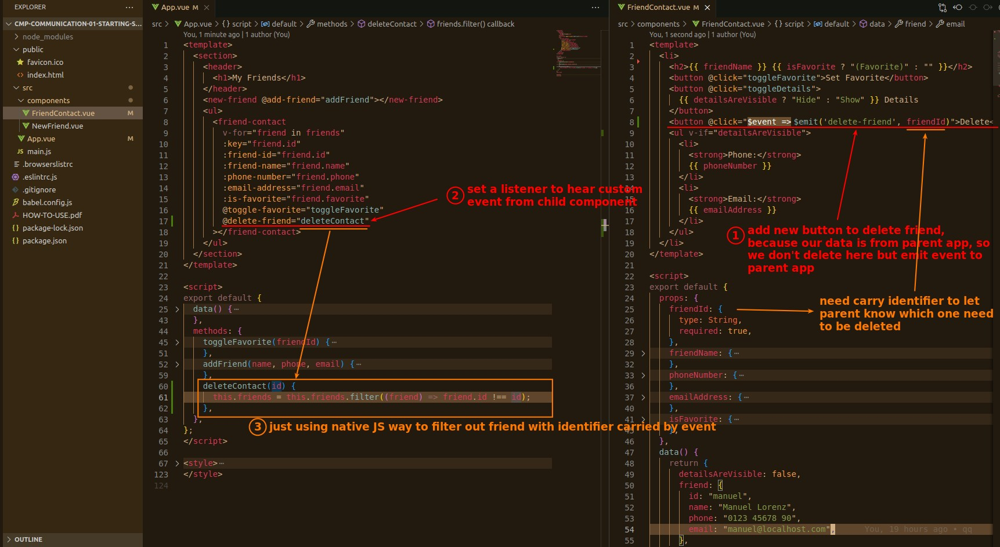
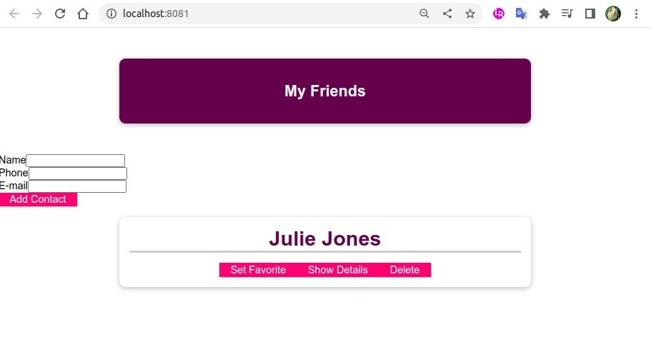

## **Add new Button 'Delete'**

- Because the script of emit event is very short, in this case it can be written directly in HTML, without the need for a separate 'methods' function.

## **Test**

