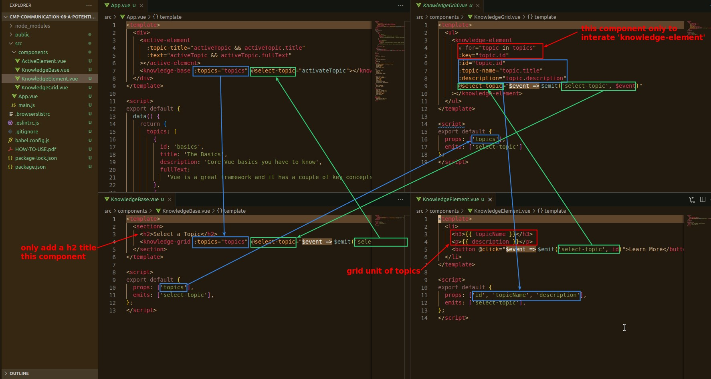
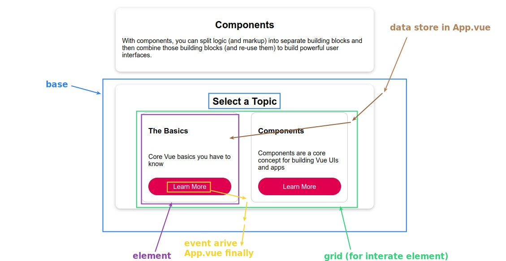

## **Event/Data GO Through Multi-Components (Codes)**

- There are only 'emits' and 'props' in the \<script\> and no other parts, so it can almost be considered as having no logical parts.

## **Event/Data GO Through Multi-Components (Page)**

- Some cases will have this happen.
- The process is very reasonable, no any mistakes, but is there a simpler way to handle it.
- only 
