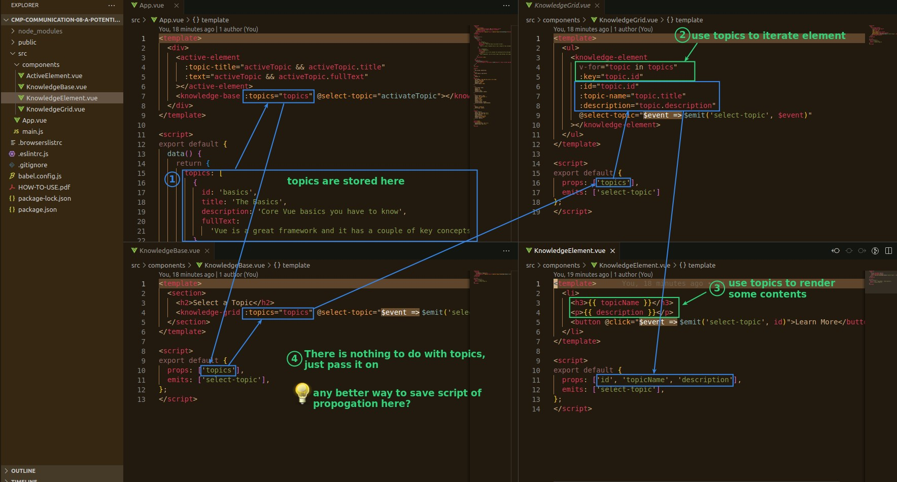
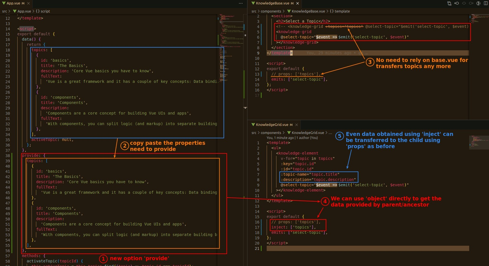
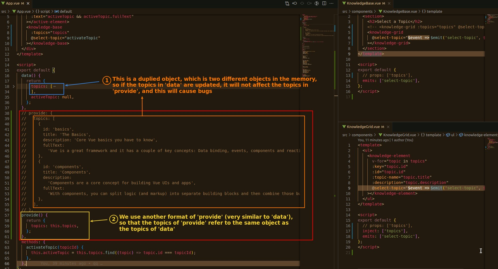

## **Issue: Data transfer is not necessary in some components**

## **Provide/Inject: Data Jump from high to low**

- Note that provide/inject must be used between components with parent/child relationships, and can also be ancestor/child relationships.
- Data can only be transferred from parent to child, but not from child to parent.
- In this case we use a mix of provide/inject and props to get the data from App.vue to element.vue eventually.
  - The provide/inject part is like jumping over some components.

## **Duplicated data of Provide**

> Duplicated data not only makes it less readable, but also creates bugs and makes it more difficult to maintain.

