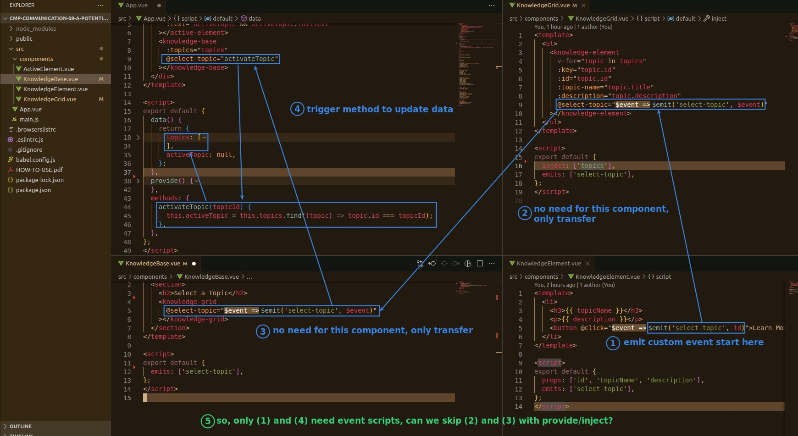
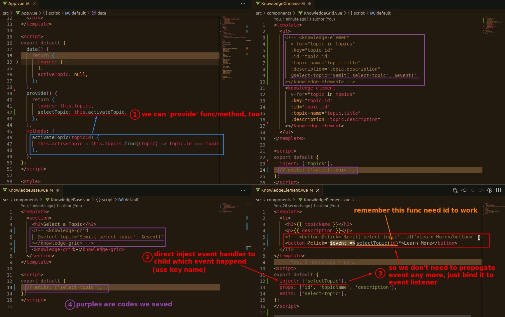

## **Issue: Can function/methods be provide/inject?**

## **Provide/Inject function/methods**

- The logic becomes very simple:
  - Where to save data to 'provide' 'methods' function(handler).
  - Inject functions to where events occur.

- But still need parent(ancestor)/child relation to do it.
