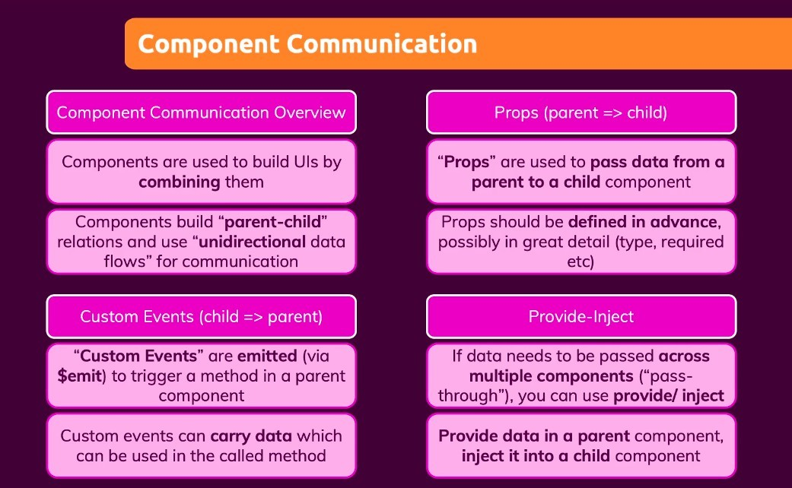

- Data cannot be passed between neighbors or siblings.

  - If there is such a need, the data must be processed in their common parent.

- Don't use provide/inject everywhere, use them only when you need to transfer data/events over long distances.
