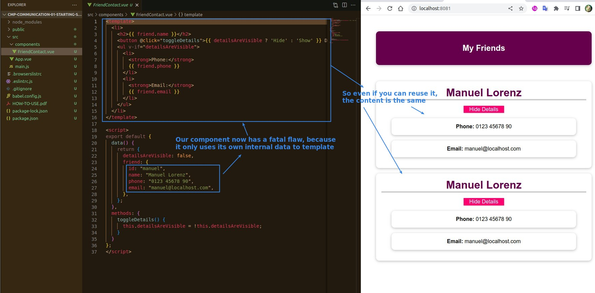
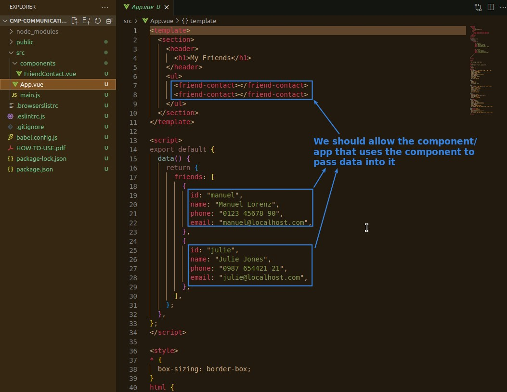
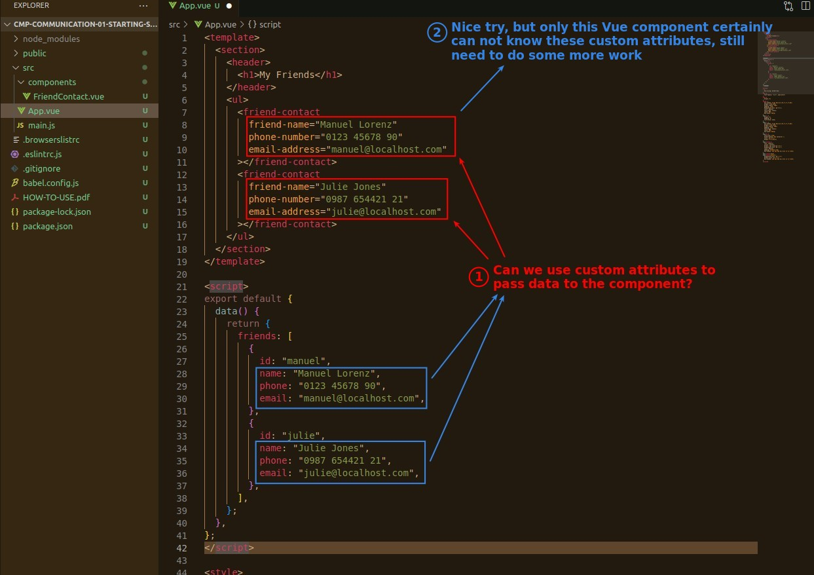
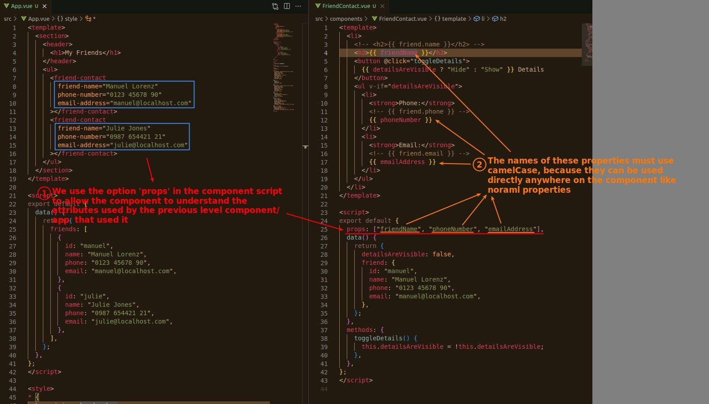

## **Component Problem & Purpose**

## **Try & Solution - 'props'**

- 'props' means 'properties'.
- attribute is using kabal nomenclature, and props is using camelCase nomenclature, the former and the latter must be related, Vue is **NOT** simply judging the relationship between the two sides according to the order.
  - Because using kapal named variables in scripts or interpolation will occur error.

