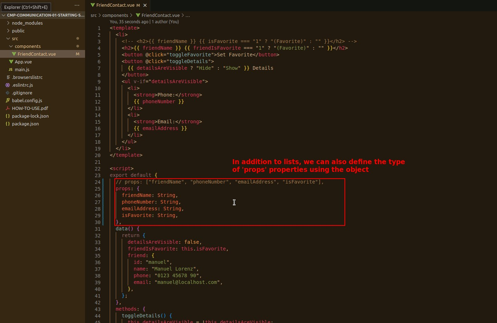
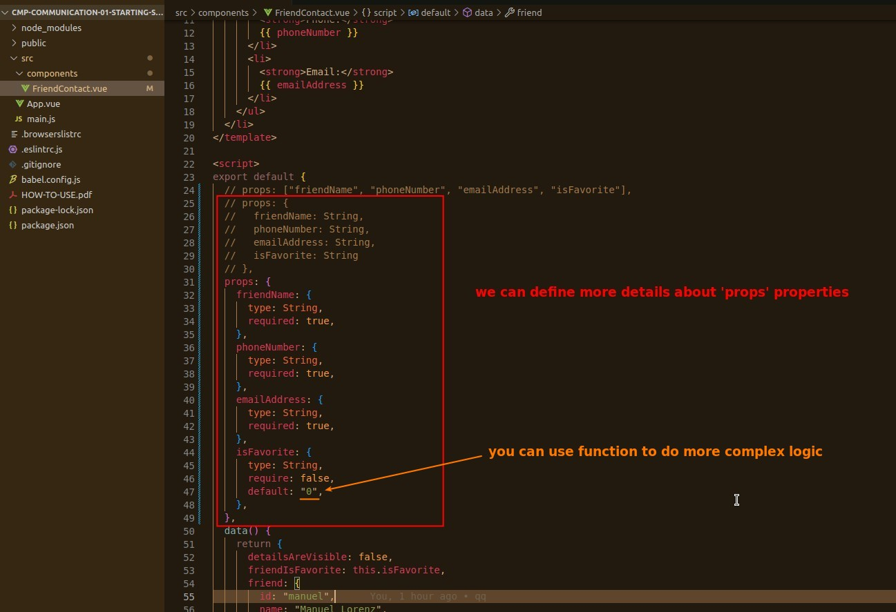
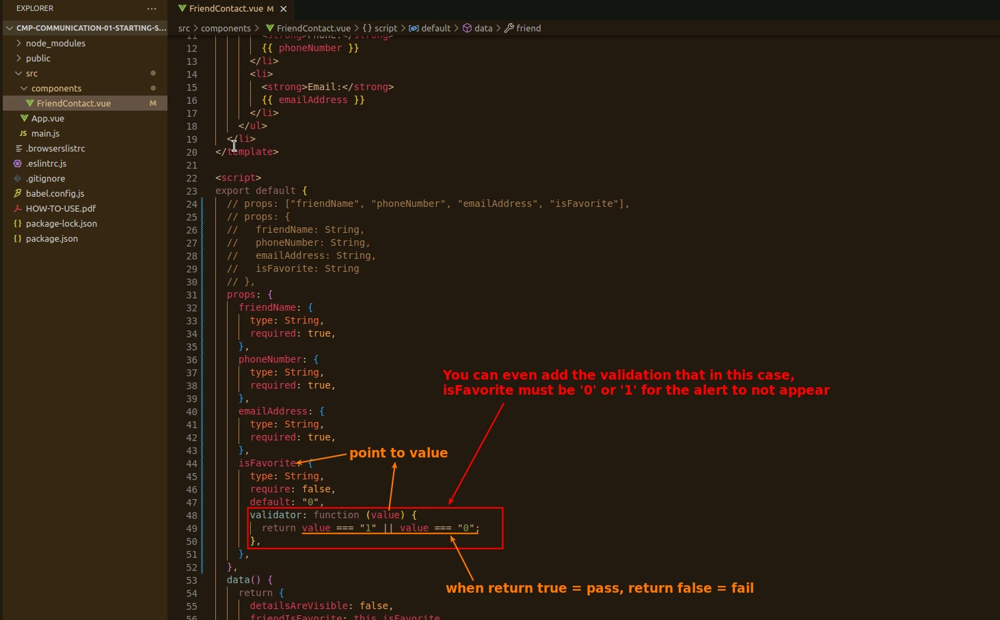
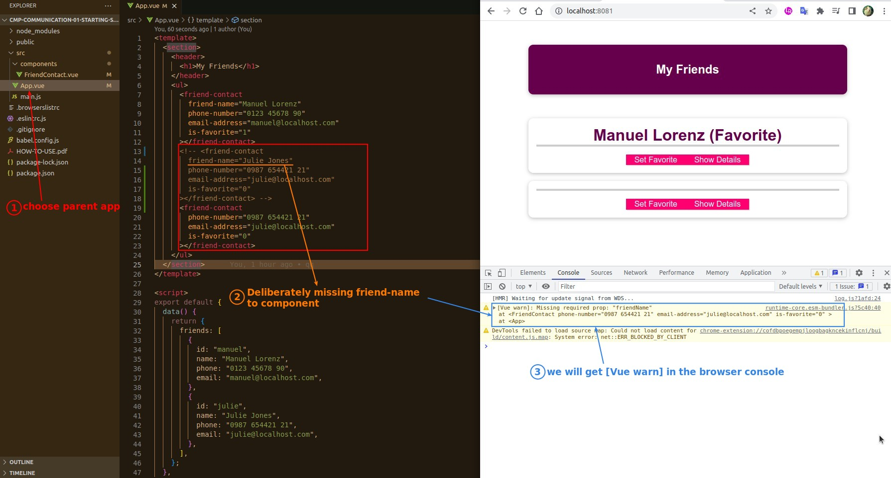
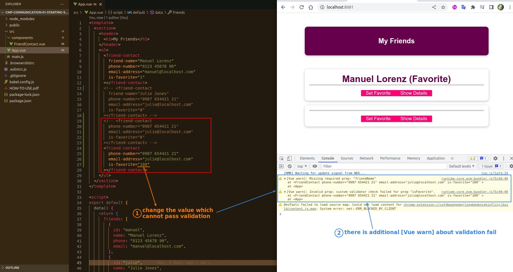

## **Set More Details of 'props' properties**

### _add type setting_

### _add require, default setting_

### _add validator setting_

## **Test**

- We set more 'prop' properties for the purpose of:
  - Making Debugging Easier
  - Let people know at a glance how to use the components you develop.
