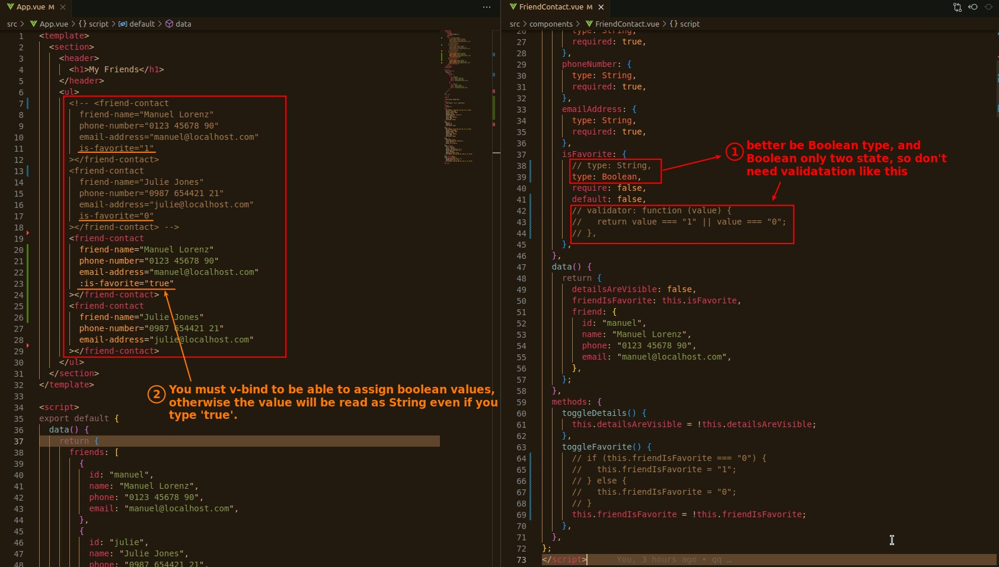

## **Change 'props' property type to Boolean**

> the point is v-bind.

## **Dynamic Pass Values to Component**

> Same as before, except the object changes from a build-in HTML element to a custom component element

