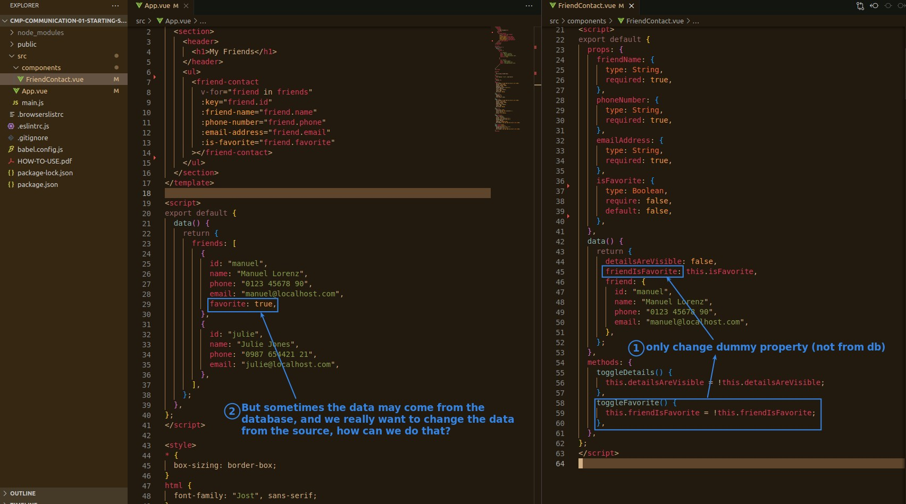
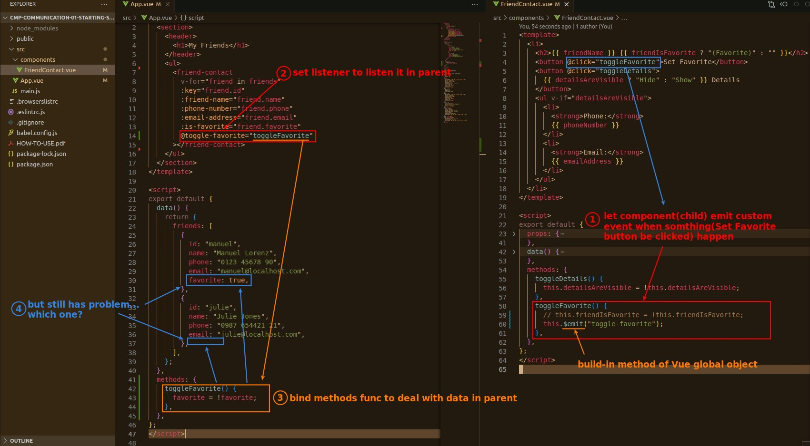
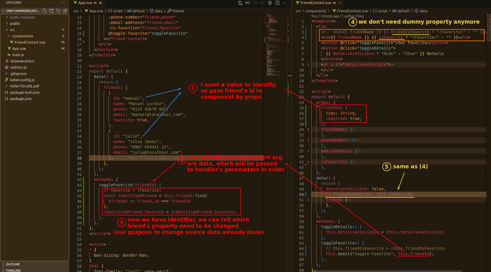

## **Purpose: change source(parent)'s data from child component**

## **Emit custom event from child component, and set Listener in parent**

- The point of the child component is to issue a custom event only using this.$emit.
- The listener and methods functions are in the parent.

## **Set identifier to tell which data need to be influenced**

- The point is that the second and subsequent arguments of this.$emit can carry data to the parent.
  - we carry identifier(friend id) to parent to tell which friend data need to be changed in this case.
