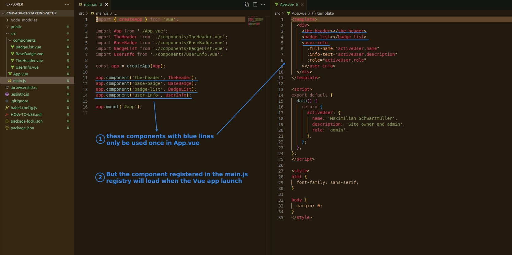
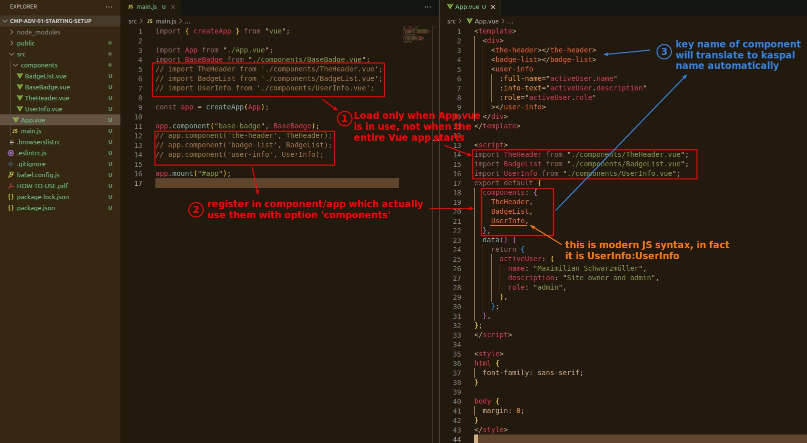
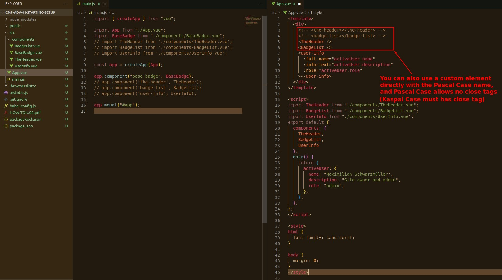

## **Global Register Components**

- When there are many components registered in main.js, some problems arise.
  - It can take a long time to load a bunch of components when the Vue app is launched.
  - Some components are not used but are loaded anyway, resulting in wasted performance.
  - Other developers cannot get the parent/child relationship between components.

## **Local Register Components**

- We can also load the same local component in different components.
  - But in such cases, the recommended way is to load it as a global.

## **Element Naming**

- If you use Kaspal Case, it will be more consistent with the HTML element name, but you must have a close tag.
- There is no right or wrong, based on personal preference.
