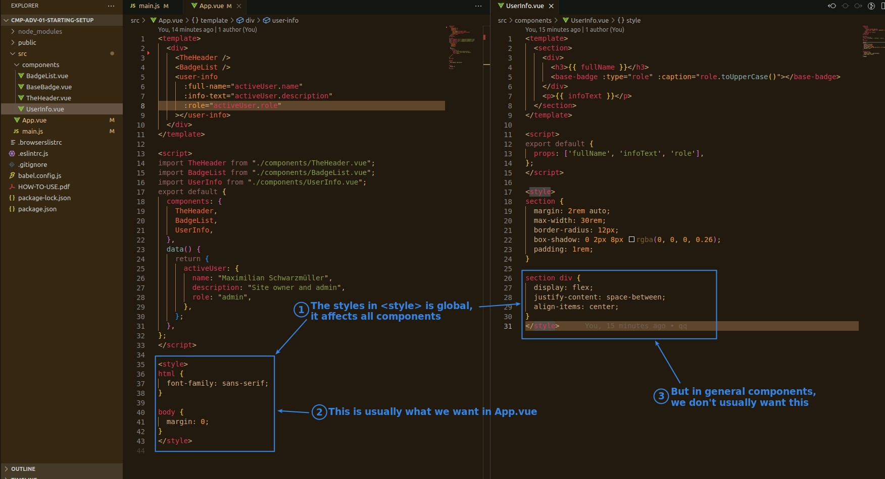
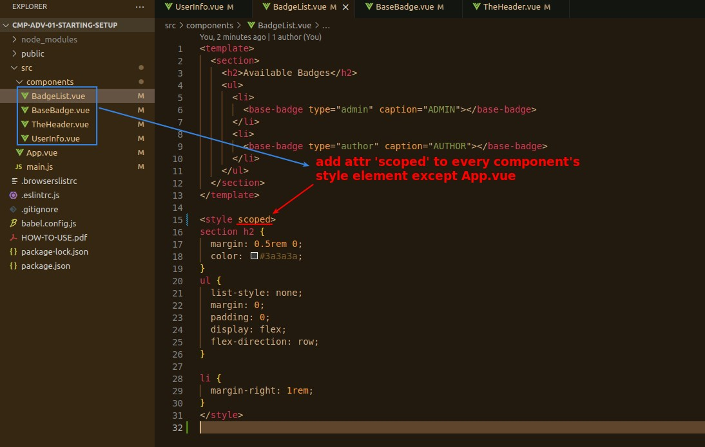
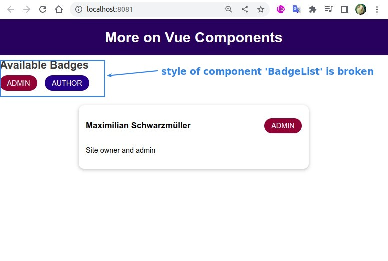
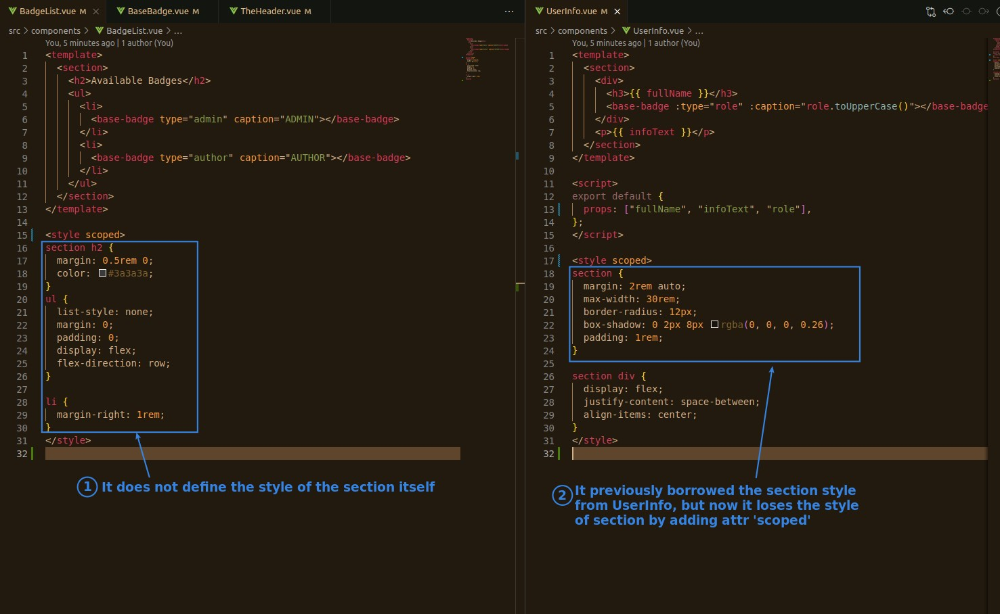
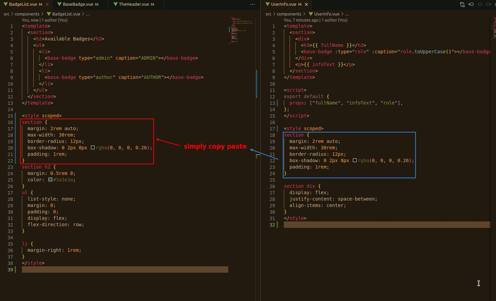
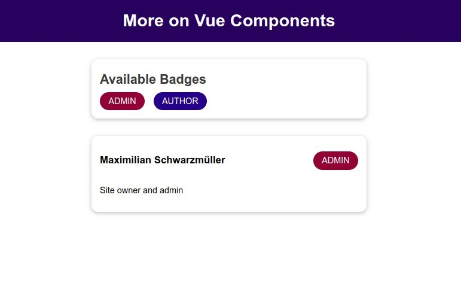

## **Component Style is global by Default**

## **Attribute 'scoped'**

## **Fix broken style**

- Usually you don't want to set the style of a general component as global, but rather use the copy paste method to fix it.

