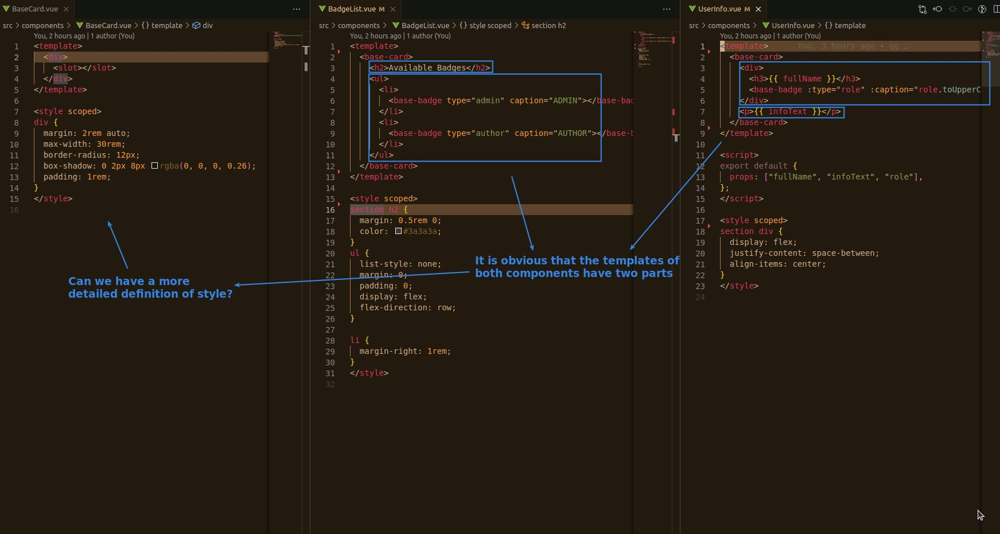
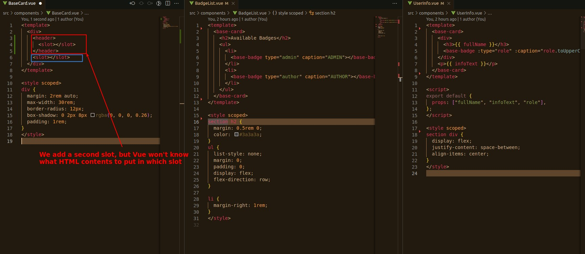
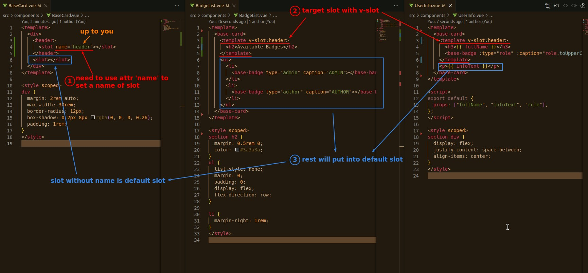
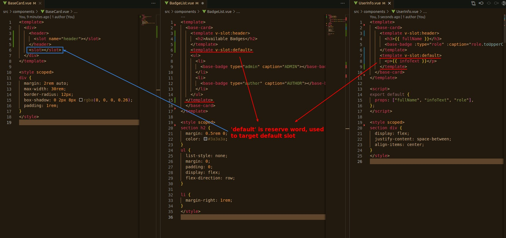

## **Can we set style more details?**

## **Multiple slots**

- We can use multiple slots in a template to do more detail styling.

## **Naming slots & target it with name**

- We can also write codes that specify the default slot, which can increase readability.
