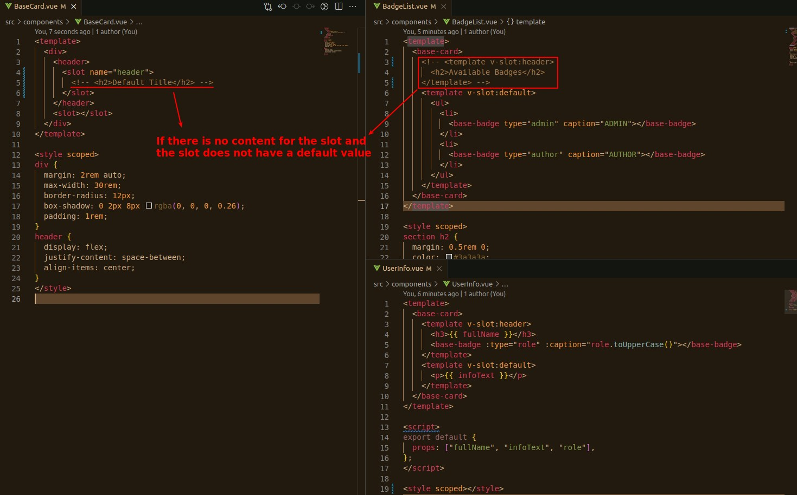
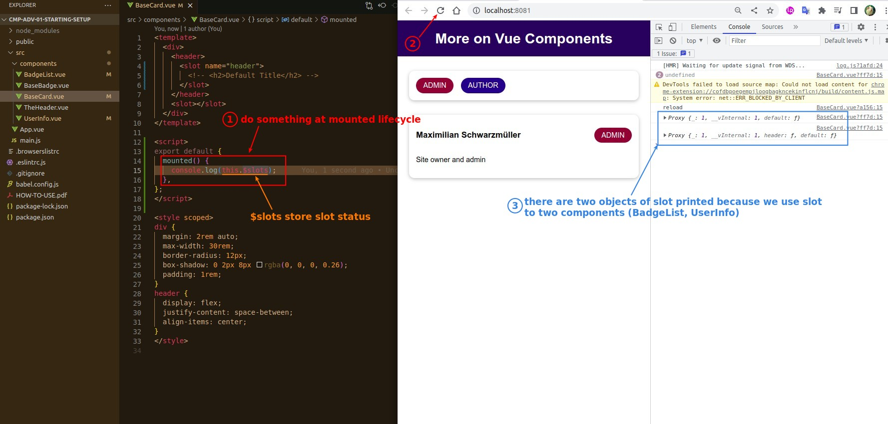
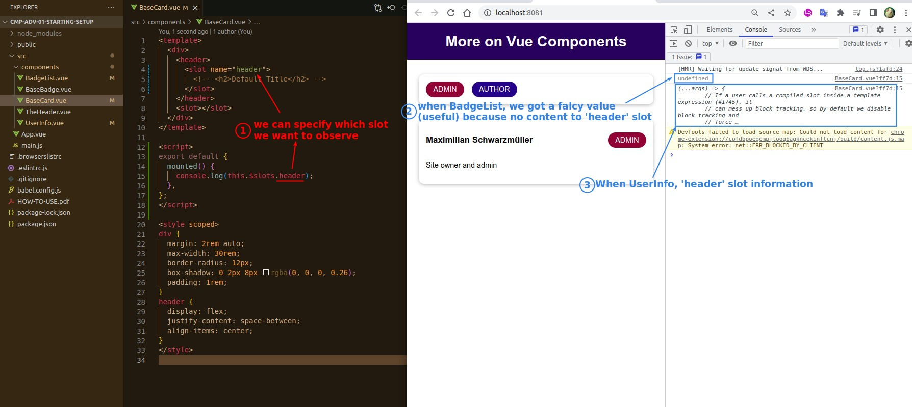

## **Default content of SLOT**

## **If No content and No Default**

## **$slot**

> This is a built-in property that holds information about the slot.

### _focus on specific slot_

### _use result of $slot to dynamic render template_

