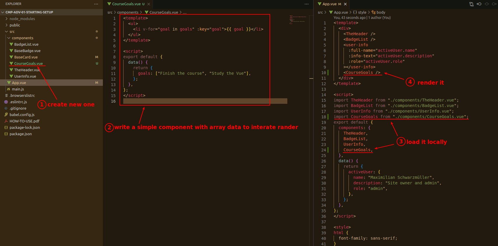
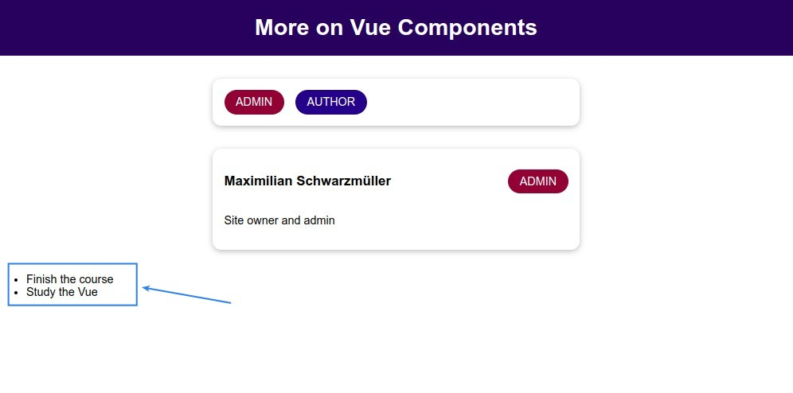
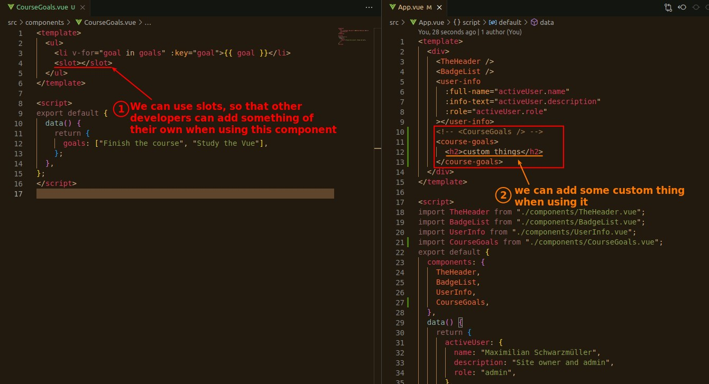
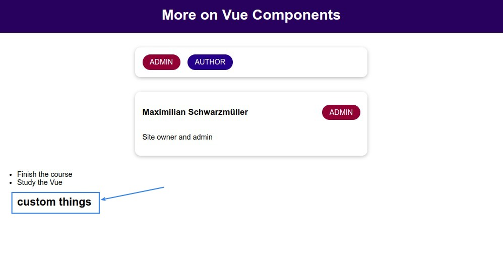
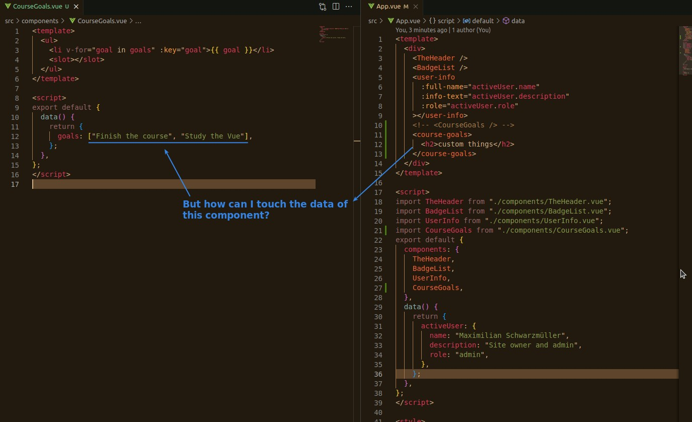
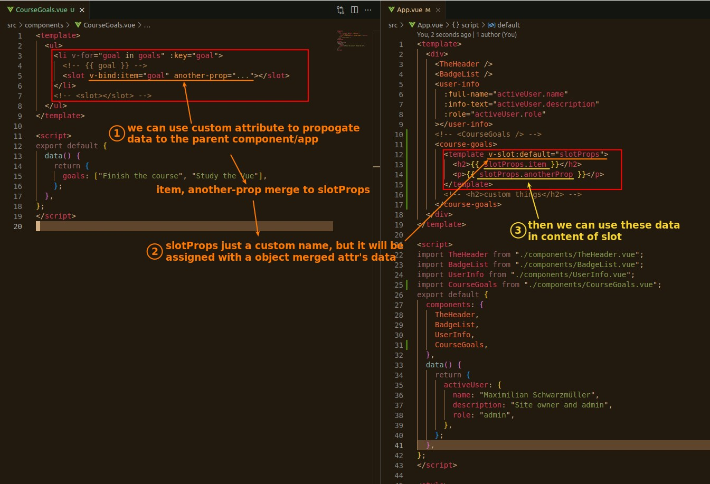
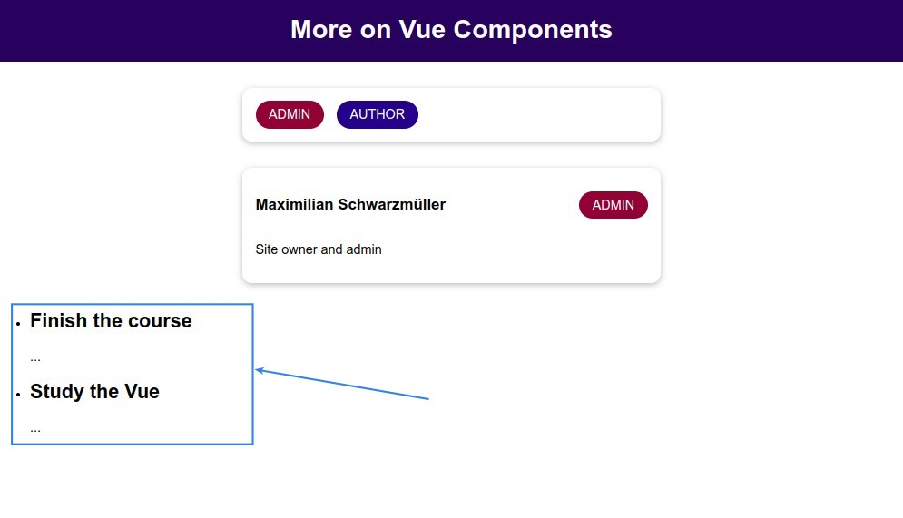
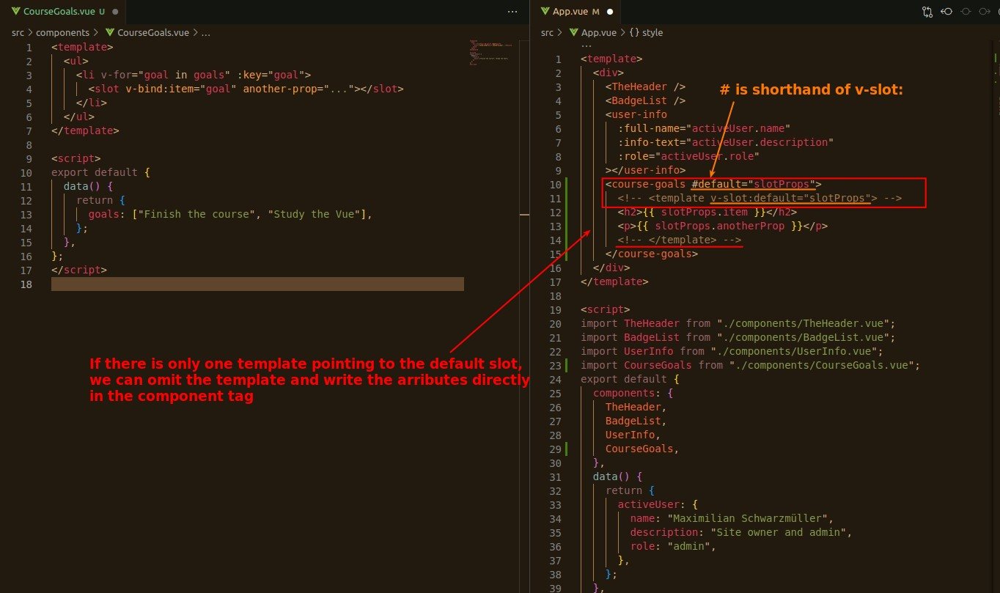

## **Prepare: create simple iteration component**

## **Let parent can add their custom content with slot**

## **Can we modify/use data belonged to component when using it?**

### _question_

### _slot props (child => parent)_

> slot props is from child to parent, direction is oppisite from general props.

### _omit template & shorthand of v-slot:_

