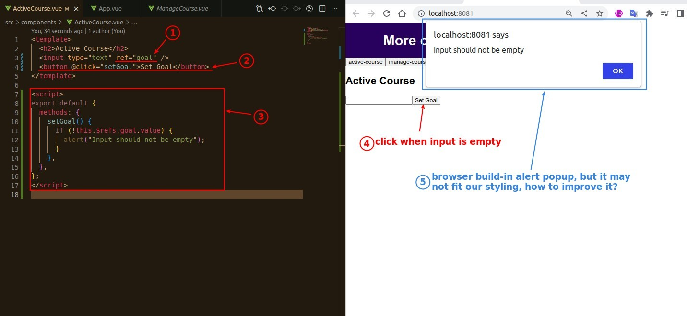
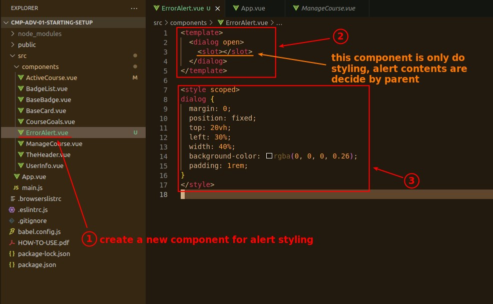
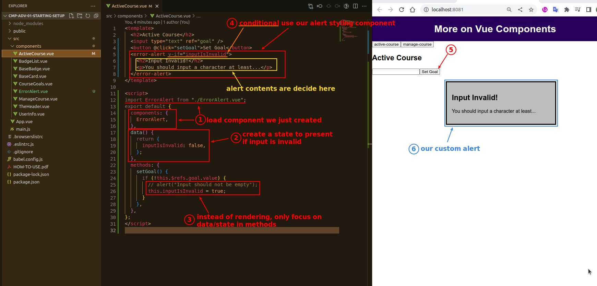

## **Default Alert**

> Creating a simple condition can trigger default alert.

## **Component for Styling Alert**

> We can create a new component dedicated to the Error Alert Styling.

## **Use Styling Alert Component**

> Then we replace the default alert with the component.

