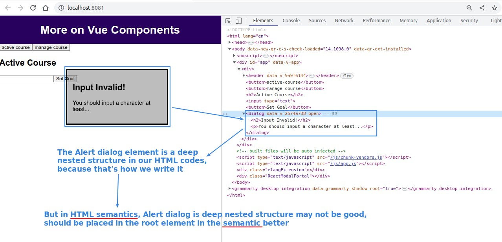
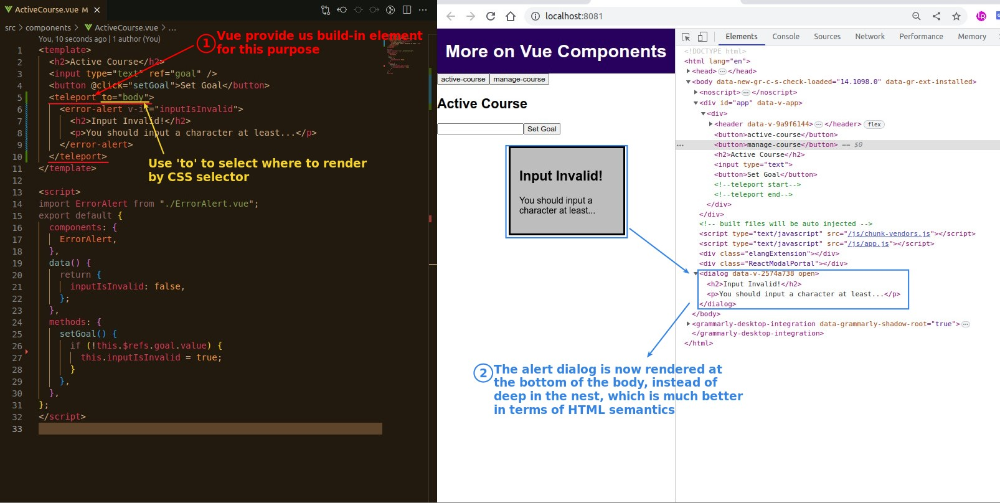

## **Issue: HTML Semantic**

## **Vue element: teleport**

- As you can see above, we can use Vue's 'teleport' element to simply determine where some of the content in the template should be rendered to.
