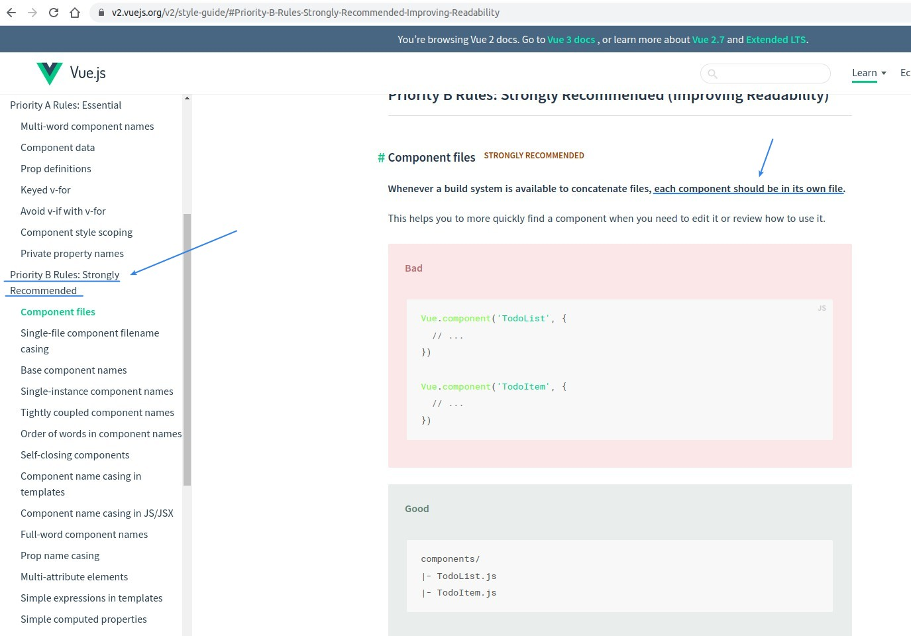
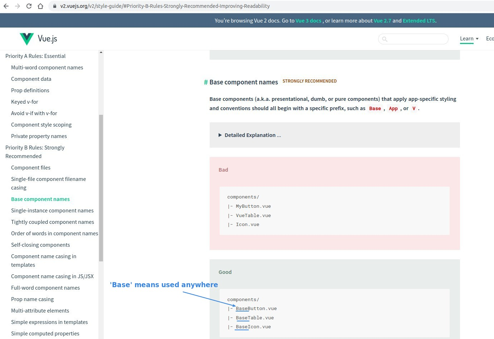
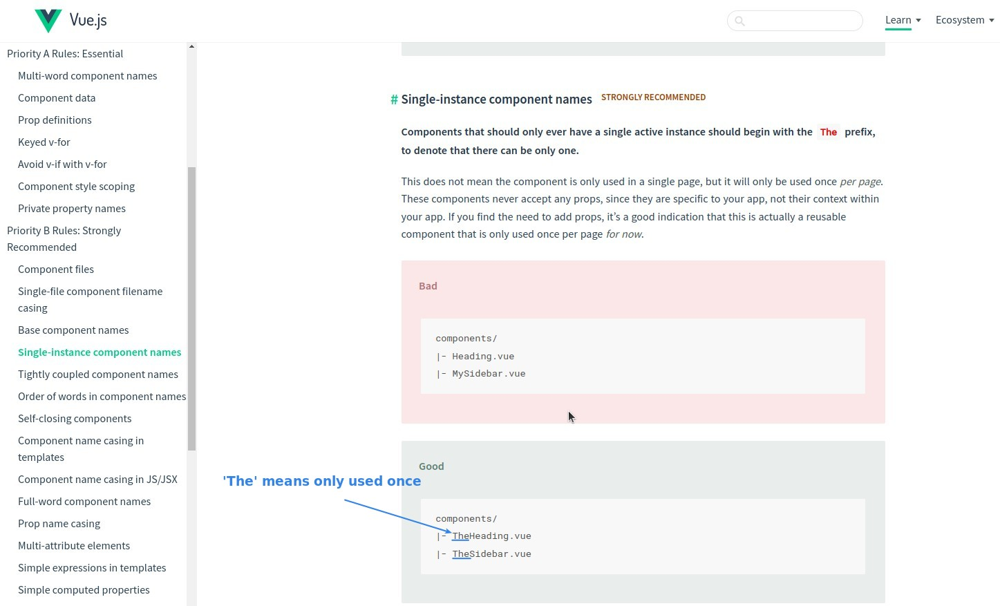

## **Official Style Guide**

> Some official advice on file and component naming rules.
> [link](https://v2.vuejs.org/v2/style-guide/)
> Here are some common rules...

### _Each component should be in it's own file_

### _Base_

### _The_

- These are just suggestions to make the team run more smoothly under the same rules.
